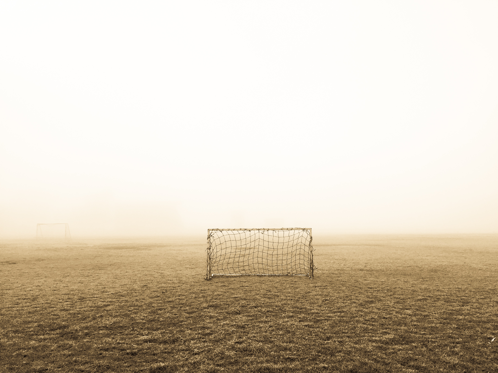

# Image Area Selector
A Javascript plugin that selects an area of an image.

## Installation
``npm install image-area-selector --save``

## Screenshots
You can view a live demo [here](http://www.iamrobert.co.uk/projects).

 

## Usage
There are four methods: setup, show, hide, capture.

### HTML
~~~~

  

<button id="done">Done</button>
~~~~

### Javascript
~~~
// Create instance of the Selector class
var selector = new Selector({
  imgId:        'img',                // The id of the image to be used for selecting
  className:    'container',          // The image will be surrounded by a div, you can give that div a class name
  onStart:      (type, result) => {}, // Function called when an action has started ('Resize' or 'Move')
  onChange:     (type, result) => {}, // Function called when an action has changed ('Resize' or 'Move')
  onEnd:        (type, result) => {}, // Function called when an action has ended ('Resize' or 'Move')
  keepAspect:   true,                 // Allow any ratio, or keep the image ratio during resizing
  customRatio:  true,                 // Use image ratio, or maxWidth/maxHeight ratio
  minWidth:     100,                  // Minimum allowed width
  maxWidth:     400,                  // Maximum allowed width
  minHeight:    75,                   // Minimum allowed height
  maxHeight:    300,                  // Maximum allowed height
  relative:     true                  // Uses dimensions as native or relative
})

// You can run this either before/after an image has loaded
// Pass in a boolean to show the selector upon load
selector.setup(true);

// Methods to show/hide the selector
select.show();
select.hide();

// Returns co-ordinates of the image
/* 
{
  width:  number, // Native width in pixels
  height: number, // Native height in pixels
  x:      number, // Native start position x
  y:      number, // Native start position y
  img:    string  // If you pass in true this will contain the cropped image.
}
*/
var result = select.capture(true);

// Returns an image in base64 format
var src = select.crop();

}
~~~~

### Stylesheet
Styling is up to you, but you can use the below for minimal styles.
~~~
* {
  box-sizing: border-box;
}

div {
  position: relative;
}

img {
  display: block;
  width: 100%;
  max-width: 500px;
}

#selector-container {
  display: inline-block;
  overflow: hidden;
}

#selector-move {
  position: absolute;
  box-shadow: 0 0 0 20000px rgba(0, 0, 0, 0.5);
  /* border: 3px dotted black; */
  cursor: move;
}

#selector-resize {
  display: block;
  position: absolute;
  top: 0;
  left: 0;
  width: 100%;
  height: 100%;
  opacity: 1;
}

#selector-resize div {
  position: absolute;
  width: 15px;
  height: 15px;
}

#selector-resize .nw {
  top: 0;
  left: 0;
  border-top: 5px solid black;
  border-left: 5px solid black;
  cursor: nw-resize;
}

#selector-resize .ne {
  top: 0;
  right: 0;
  border-top: 5px solid black;
  border-right: 5px solid black;
  cursor: ne-resize;
}

#selector-resize .sw {
  bottom: 0;
  left: 0;
  border-bottom: 5px solid black;
  border-left: 5px solid black;
  cursor: sw-resize;
}

#selector-resize .se {
  bottom: 0;
  right: 0;
  border-bottom: 5px solid black;
  border-right: 5px solid black;
  cursor: se-resize;
}
~~~
